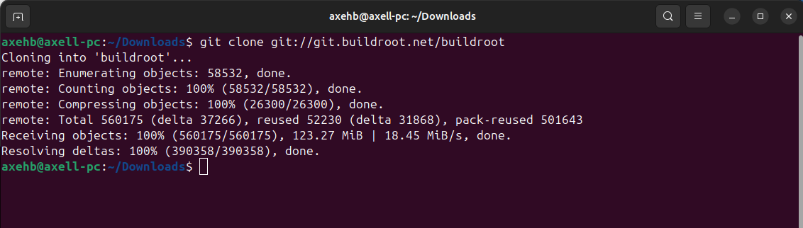
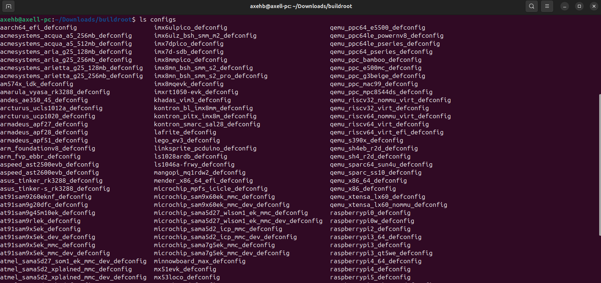
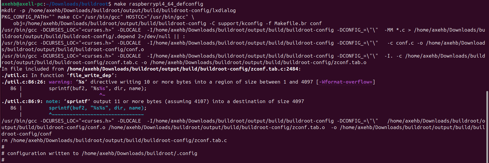
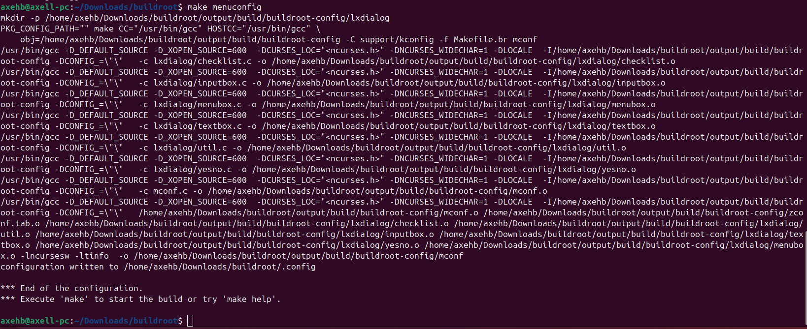
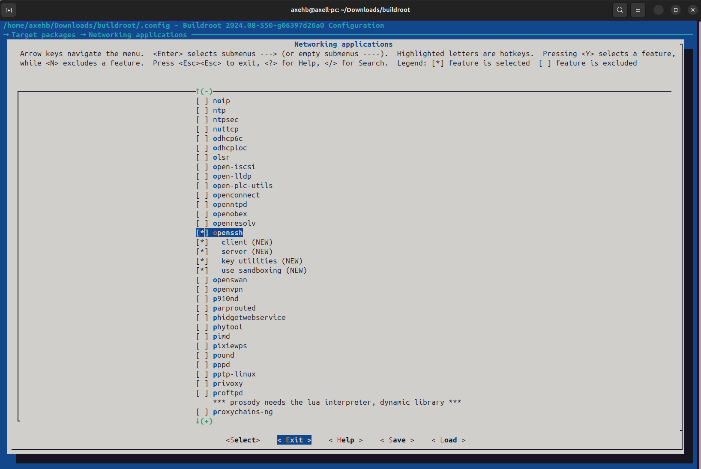
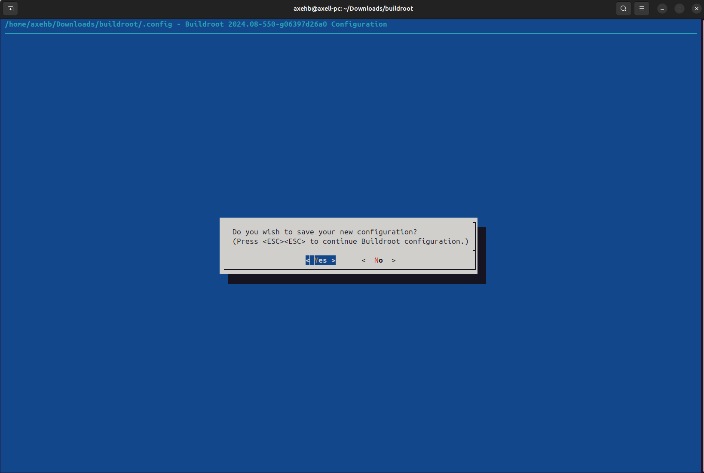

# Buildroot guide

First we start by cloning Buildroot repo from github 
  
Inside this directory we can see raspeberry configuration  
  
So we compile based on that board  
  
Then we can exectute the UI for extra tools that we may need  
  
Here let's say for example that we need open SSH and we add it  
  
We exit and we are asked automatically to save the configuration  
  
After that we get our final image compiled with the name of sdcard_image  
And in this case we flashed it using the Raspberry Pi Imager.  
We can see Buildroot welcoming us.    
  
Login as root and applying some disk usage commands  

