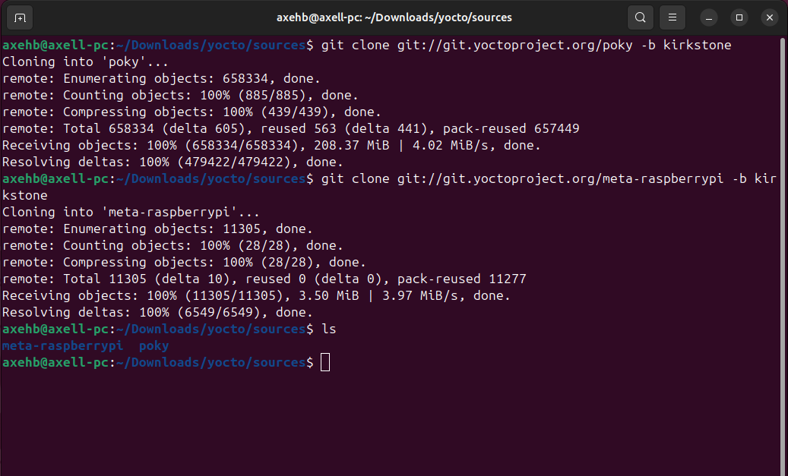
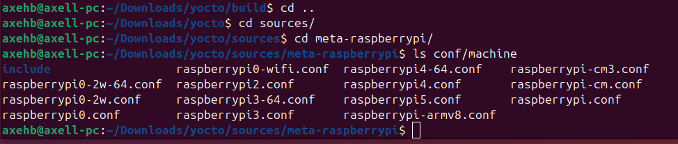
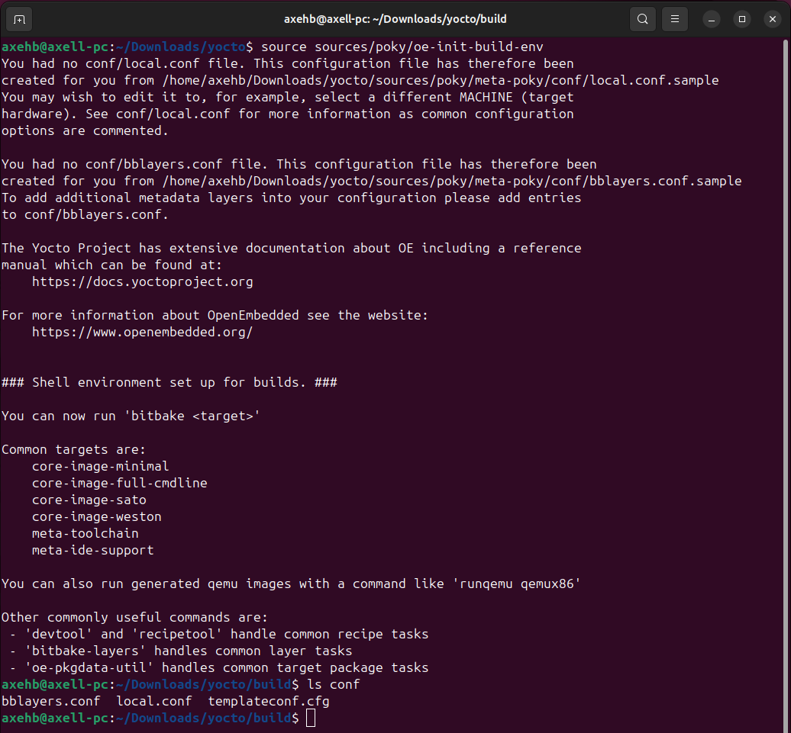
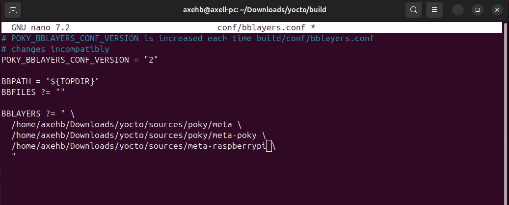
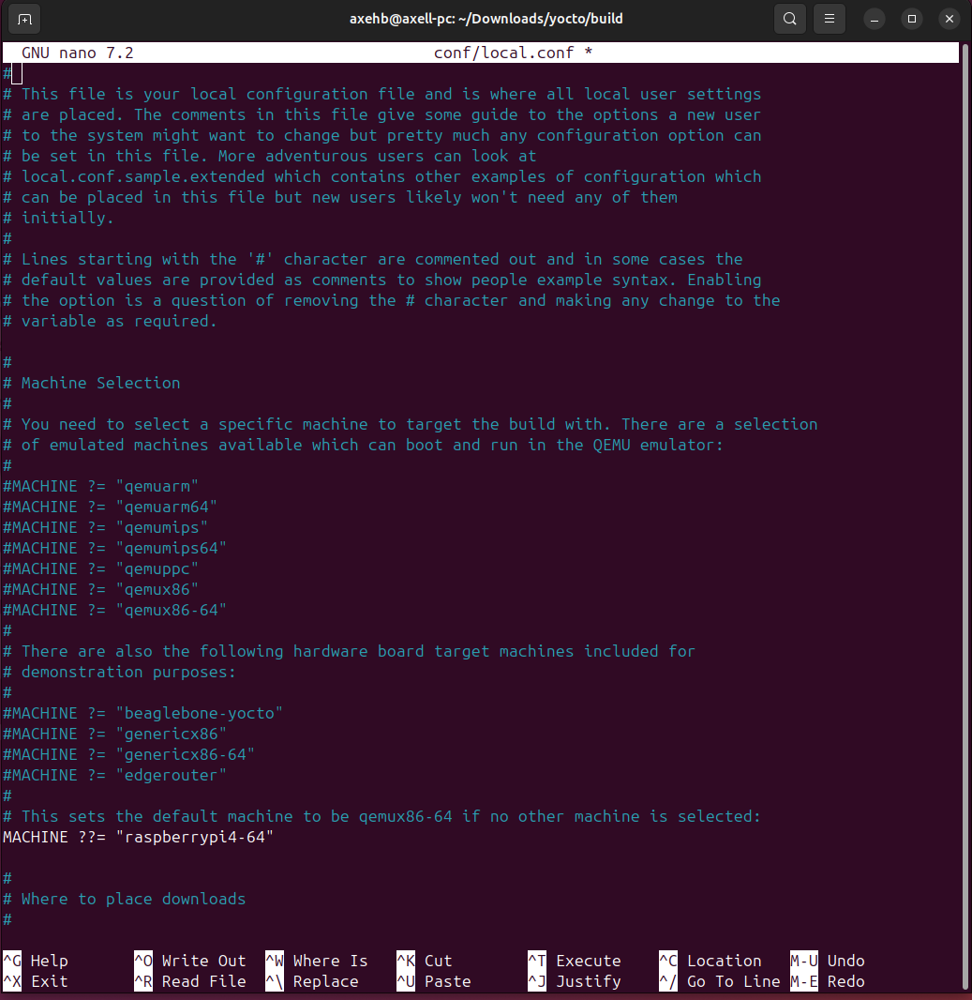
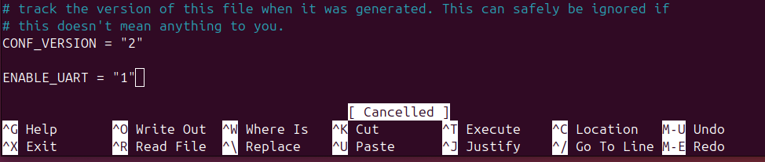
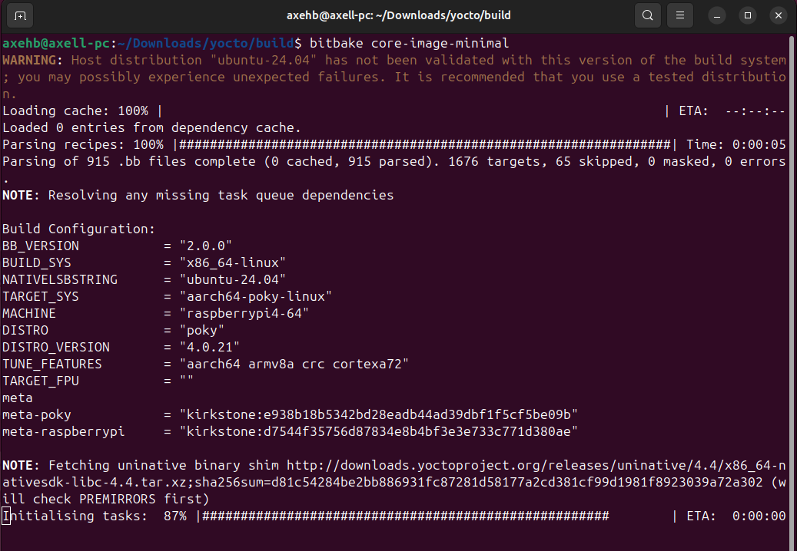
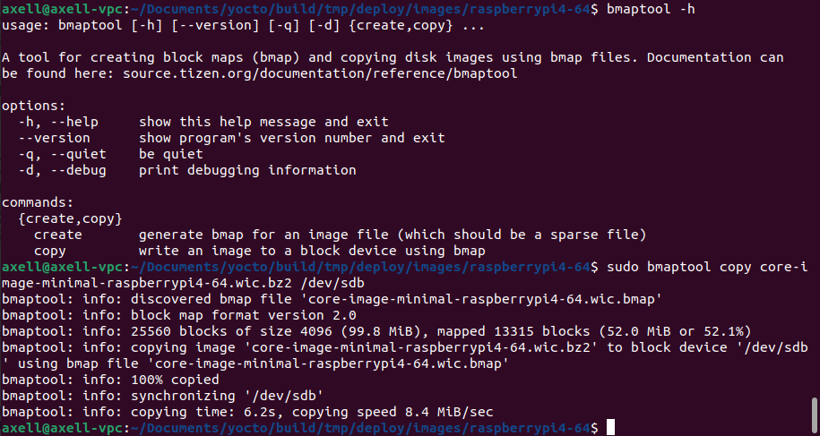
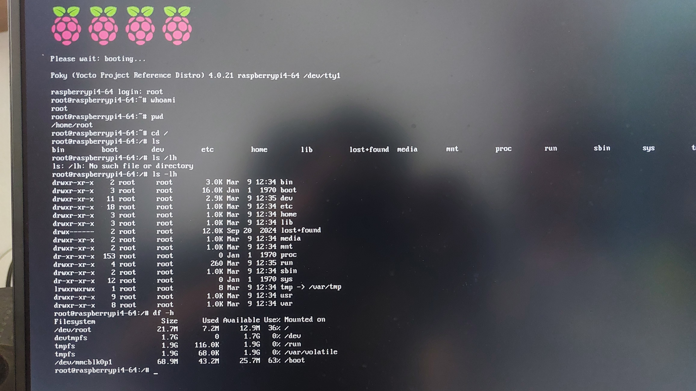
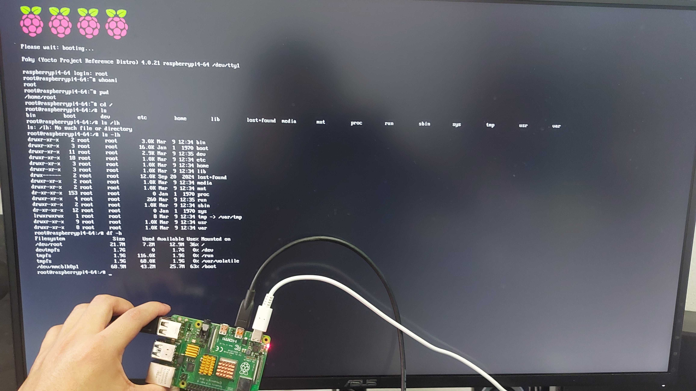

# Yocto Project

First we start by cloning the yocto project but avoiding the development branch  
and sticking to any other like the kirkstone one.  
Yocto works through layers so we also add the raspberry pi layer called "meta raspberry"<br><br>
<br><br><br>
We access to this directory to check what name will be used to include inside the configuration<br><br>
<br><br><br>
Then we are ready to source this directory in order to have a dedicated "build" directory  
and where a couple of important files are generated: local.conf and bblayer.conf  
this build directory will also have our final image inside the temp/ directory<br><br>
<br><br><br>
We add our specific hardware layer directory in this file<br><br>
<br><br><br>
And based on the name given inside the meta-rapsberry/conf/machine directory we replace it in this file<br><br>
<br><br><br>
We add this optional line in case our Raspberry does not have a dedicated HDMI port or USB to connect keyboard  
and facilitate things, and we can also communicate through UART<br><br>
<br><br><br>
Inside our build directory we can use bitbake and a preselected type of recipe to compile our image  
In this case we select core-image-minimal as our recipe<br><br>
<br><br><br>
Then we use the bmap tool, in here we can see a brief description using -h flag  
Prior to this we must insert our sd card whether using an adapter or not, sd cards usually load with partitions  
I could check this using `df -h` to check what letter was assigned (in this case "b" given dev/sdb) to my sd card.  
Now I could use the `mount` command to check how many partitions I had on dev/sdb: dev/sdb1 and dev/sdb2  
and then use `umount` command to unmount both of them like this:
```
umount dev/sdb1
umount dev/sdb2
```
Only after this we can then apply bmaptool command with the copy flag with the image created and sd card directory as arguments<br><br>
<br><br><br>
Then we can insert the sd card into our Raspberry pi and see Yocto project reference as the main displayed text  
We can also use some commands about disk usage, having logged in as root users<br><br>
<br><br><br>
<br><br><br>
